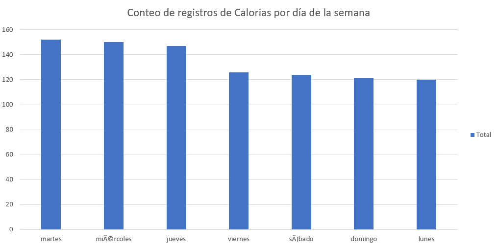
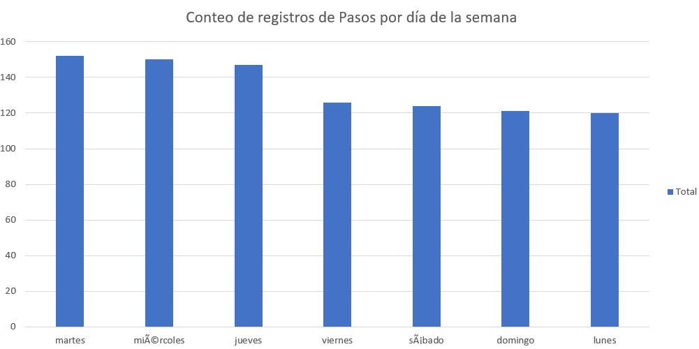

```{r setup, include=FALSE}
knitr::opts_chunk$set(echo = TRUE)
```

## Contenido

-   [Contexto]
-   [Paso cero]
-   [Preparar]
-   [Procesar]
-   [Analizar y Compartir]
    -   [Por día de la semana]

    -   [Hipótesis de pesos]

    -   [Relaciones entre variables]

        -   [Diario]

        -   [Sueño]

        -   [Juntos]
-   [Actuar]
-   [Referencias]

## Contexto

En este proyecto se simula el trabajar para la empresa Bellabeat.

Urška Sršen y Sando Mur fundaron Bellabeat, una empresa de alta tecnología que fabrica productos inteligentes focalizados en el cuidado de la salud.

¿Qué ha hecho?

-   Invirtió en medios tradicionales y en marketing digital
-   Invierte en google search y mantiene activas sus redes sociales
-   Anuncios de video en YT y avisos publicitarios en Red de Display Google en fechas clave.

Orden de trabajo:

Concentrarse en un producto Bellabeat y analizar los datos de uso de dispositivos inteligentes para conocer cómo las personas están usando sus dispositivos inteligentes. Emitir recomendaciones de alto nivel sobre cómo estas tendencias pueden colaborar en la estrategia de marketing de Bellabeat.

## Paso cero

A modo de replicar mi trabajo en el futuro desde una perspectiva donde no recuerde absolutamente nada de lo que estoy haciendo ahora mismo, vi necesario incluir este paso donde primero tuve que decidir en que plataforma realizaría la publicación de mi trabajo y resolví que github es la plataforma más actualizada que además de alojar mi proyecto serviría para aprender a utilizar esta herramienta de control de versiones y que tambien me ayudaría a crear un portafolio inicial.

Tuve que aprender desde como crear un archivo README en R a conectar Git desde la misma interfaz de R studio y añadí mi proyecto a github utilizando las siguientes líneas de comandos:

-   git remote add origin <https://github.com/AngelGurrola/bellabeat_proyect.git>
-   git branch -M main
-   git push -u origin main

Utilice el videotutorial de Riffomonas Project para aprender como conectar RStudio con github disponible en: <https://www.youtube.com/watch?v=bUoN85QvC10&t=505s>

Una vez teniendo la plataforma lista comence con mi proyecto de análisis de datos para Bellabeat.

## Preparar

Comenzamos con importar el conjunto de datos: descargamos la carpeta comprimida desde: <https://www.kaggle.com/datasets/arashnic/fitbit>

Al descomprimir la carpeta de datos se observan 18 tablas con un peso de 322 MB en donde los títulos de cada una nos dan contexto del contenido y el peso de las mismas nos ayudan a dimensionar la cantidad de datos que poseen, siendo la tabla heartrate_seconds_merged la más pesada con 87.4 MB y weightLogInfo_merged la mas lígera con 7 KB.

Se añadieron todos los archivos al directorio de trabajo después de darles un vistazo rápido desde hoja de cálculo.

La tabla base de donde obtendremos las primeras hipotesis será dailyActivity_merged, la cual provee un resumen diario de los totales de información recolectada por los dispositivos de Bellabeat.

Entonces se procede a importar las tablas como conjunto de datos de R.

```{r}
library(readr)
library(dplyr)
library(ggplot2)
library(tidyverse)
pesos <- read.csv(file="C://Users//an_96//Documents//Bellabeat//Bellabeat//archive//Fitabase Data 4.12.16-5.12.16//weightLogInfo_merged.csv")
pasos <- read.csv(file="C://Users//an_96//Documents//Bellabeat//Bellabeat//archive//Fitabase Data 4.12.16-5.12.16//hourlySteps_merged.csv")
diario <- read.csv(file="C://Users//an_96//Documents//Bellabeat//Bellabeat//archive//Fitabase Data 4.12.16-5.12.16//dailyActivity_merged.csv")
sueño <- read.csv(file="C://Users//an_96//Documents//Bellabeat//Bellabeat//archive//Fitabase Data 4.12.16-5.12.16//sleepDay_merged.csv")
calorias <- read.csv(file="C://Users//an_96//Documents//Bellabeat//Bellabeat//archive//Fitabase Data 4.12.16-5.12.16//dailyCalories_merged.csv")
```

Durante la revisión rápida en hojas de cálculo se observaron notables diferencias en la cantidad de datos, por lo tanto, se procedió a confirmar la cantidad de Id que contenían algunas de las tablas.

```{r}
n_distinct(pesos$Id)
n_distinct(pasos$Id)
n_distinct(diario$Id)
n_distinct(sueño$Id)
n_distinct(calorias$Id)
```

Se observa como la tabla de pesos incluye únicamente los datos de 8, individuos por lo que deja de ser relevante para el análisis al no ser una variable que incluyan en todas las tablas.

Se observa también que la tabla de sueño contiene únicamente los registros de 24 usuarios.

***Desde este punto considero importante mantener un registro más habitual del peso de los usuarios mediante una notificación de recordatorio a registrar tu peso.***

Para explorar las tablas se utilizó la librería de tidyverse

```{r}
glimpse(diario)
```

De esta exploración se observó que la fecha podría convertirse en un formato que permita manipulación para facilitar el análisis así como el tipo de datos que se tienen en las distintas columnas.

```{r}
# diario
diario$ActivityDate=as.POSIXct(diario$ActivityDate, format="%m/%d/%Y", tz=Sys.timezone())
diario$fecha <- format(diario$ActivityDate, format = "%m/%d/%y")
```

```{r}
# En sueño manipulamos para quitar la hora
sueño <- within(data=sueño, SleepDay <-data.frame
                     (do.call('rbind',strsplit(SleepDay," ",fixed=TRUE))))
sueño$SleepDay$X1=as.POSIXct(sueño$SleepDay$X1, format="%m/%d/%Y", tz=Sys.timezone())
sueño$fecha <- format(sueño$SleepDay$X1, format = "%m/%d/%y")
```

Para obtener una mayor descripción de los datos se utilizó la siguiente función para obtener un resumen de los datos en la tabla de "diario".

```{r}
diario %>%  
  select(TotalSteps, TotalDistance, SedentaryMinutes, Calories) %>%
  summary()
```

Desde este punto se pueden determinar las respuestas a las preguntas clave de esta parte del reto:

Los datos tienen un formato largo y se organizan en 18 tablas almacenadas en archivos csv. Se detectan grandes problemas de sesgo al tener únicamente 33 usuarios, de los cuales no se añaden contexto demográfico como su ubicación, edad, sexo (se infiere que son mujeres, pero no se confirma) etc.

Si bien, la pregunta de los interesados está enfocada a la implementación de una nueva campaña de marketing para la utilización de los productos de bellabeat sobre los de la competencia, yo consideraría la posibilidad de ampliar la cantidad de datos para obtener mejores resultados y un nivel de confianza aceptable.

Para efectos del reto enfocaré los datos a esta pequeña población, tratándola como un punto de partida para la formulación de hipótesis que se podrán confirmar con un estudio posterior donde se observen cantidades de datos significativas.

Se acotará el análisis a las variables de actividad diaria que incluye calorías y a su vez, la tabla sueño y la tabla pesos que contienen información diaria.

## Procesar

Como se explicó anteriormente, se utilizará el lenguaje de programación R desde RStudio Desktop para este proyecto, así como el sitio de Github para su publicación y almacenamiento.

Se procede a buscar duplicados dentro del conjunto de datos.

```{r}
sum(duplicated(diario))
sum(duplicated(pasos))
sum(duplicated(calorias))

sum(is.na(diario))
sum(is.na(pasos))
sum(is.na(calorias))
```

Al no encontrarse duplicados en las variables de análisis ni valores NA se procedió a buscar la cantidad de registros para cada usuario, es decir, la cantidad de días que tenía cada usuario en su récord diario.

```{r}
dias <- diario %>% group_by(Id) %>% 
     summarise(conteo_dias=n(),
               .groups = 'drop')
hist(dias$conteo_dias)
```

Mediante un histograma básico, se observó una cantidad distinta de registros para los usuarios.

Se considera reducir el análisis a solo los individuos con más de 25 registros para evitar sesgos por registros incompletos que lleguen a alterar las cifras completas, sin embargo, se plantea clasificar a los usuarios como usuarios que no utilizan los productos habitualmente y se busca aplicar un enfoque distinto creando una columna para el día de la semana en que se realizó el registro.

Para añadir esta variable se extrae de la columna de fecha el día de la semana que se realizó el registro.

```{r}
diario <- diario %>% mutate( Dia_semana = weekdays(as.Date(fecha, "%m/%d/%Y", tz=Sys.timezone())))
head(diario)
```

Antes de pasar a analizar el conjunto de datos, combinaremos la tabla de diario con la de sueño para obtener todos los datos diarios de los usuarios

```{r}
sueño <- sueño[,-c(2)]

juntos <- merge(sueño, diario, by=c('Id', 'fecha'))
head(juntos)
```

La tabla juntos contiene todas las variables de estudio y los datos de los usuarios reunidos en una única tabla, por lo que será seleccionada como principal.

Tras haber realizado esta manipulación de los datos, y tomar en cuenta las consideraciones previamente declaradas. Se procede al siguiente paso del proyecto.

## Analizar y Compartir

Primeramente, recordaremos los encabezados de nuestra tabla

```{r}
colnames(juntos)
```

```{r}
juntos %>%
  select(TotalMinutesAsleep, TotalTimeInBed, TotalSteps, TotalDistance, SedentaryMinutes, Calories) %>%
  summary()
```

### Por día de la semana

Para comparar los datos desde la perspectiva de día de la semana se exportó el archivo csv que por cuestiones de tiempo facilitó el análisis y la creación de gráficos.

Usando la función:

write.csv(diario, file = "diario.csv")

De igual manera se intentaron realizar las gráficas desde R:

```{r}
##diario$Dia_semana = factor(diario$Dia_semana, levels = c("lunes", "martes", "miércoles", "jueves", "sábado", "domingo"))
```

```{r}
df %>%
ggplot(data = juntos, mapping = aes(x = Dia_semana, y = TotalSteps, fill = Dia_semana))+ geom_bar(stat = "identity", position = "dodge") + labs(title = "Pasos por día de la semana") 
```

```{r}
library(forcats)
df %>%
ggplot(data = juntos, mapping = aes(x = fct_rev(fct_reorder(Dia_semana, Calories)), y = TotalSteps, fill = Dia_semana))+ geom_bar(stat = "identity") + labs(title = "Calorias por día de la semana") 
```

Para corroborar el uso de los dispositivos de Bellabeat por día de la semana se graficaron los registros en excel como se muestra en las siguientes imagenes:





Se observó como los días martes, miercoles y jueves tienen la mayor cantidad de registros, y domingo y lunes la menor cantidad de los mismos.

***Se puede realizar una encuesta a los usuarios acerca de porque no utilizan los productos durante el fin de semana que podría retroalimentar al equipo para mejorar su usabilidad incluso durante el descanso de fin de semana.***

### Hipótesis de pesos

Aun cuando se descartó la importancia de la tabla de pesos, resumiremos los datos para conocer las características de los usuarios que sí registraton datos.

```{r}
usuariospesos <- pesos %>% 
  select(Id, BMI, IsManualReport) %>% 
  group_by(Id, IsManualReport) %>%  
  summarise(IMCpromedio = mean(BMI), n = n())
arrange(usuariospesos, IMCpromedio)
```

De esta tabla esperaba obtener la cantidad de reportes efectuados manualmente considerando el IMC de la persona. Buscando una relación entre las variables, sin embargo, por la cantidad de datos se debe resolver primero que se obtengan los datos de más participantes. Considero que uno de los mejores indicadores de la salud de una persona es el Indice de Masa Corporal (BMI en inglés) y por tanto *se me ocurre **ofrecer paquetes de productos donde se utilicen productos que monitoreen el IMC para que la aplicación de Bellabeat ofrezca notificaciones cuando este se vea fuera de sus parámetros normales, pasando a un monitoreo activo de tu IMC.***

### Relaciones entre variables

#### Diario

En este apartado se revisaron las diferentes correlaciones que pueden existir dentro de la tabla de diario.

Se comenzó por una hipotesis obvia donde a mayor cantidad de pasos, mayor cantidad de calorías visualizando como se muestra a continuación:

```{r}
ggplot(data=diario, aes(x=TotalSteps, y=Calories)) + 
  geom_point() + geom_smooth() + labs(title="Calorias vs. Pasos totales")
```

*Se pueden crear indicadores para los usuarios donde se indique la cantidad de calorias que han quemado con base a sus pasos y si quieren fijar una meta de calorías convertirla a una meta de pasos o distancia por recorrer.*

```{r}
ggplot(data=diario, aes(x=SedentaryMinutes, y=VeryActiveMinutes)) + 
  geom_point() + geom_smooth() + labs(title="Min sedentarios vs. Min Activos")
```

Se esperaba observar una relación negativa entre estas variables que, aunque existe una tendencia negativa, no se confirma con certeza, esto podría deberse a la poca cantidad de datos , sin embargo, es interesante ver puntos con altos niveles de ambas variables, tal vez, refiriendose a personas que durante su jornada laboral entran en la clasificación de sedentario pero que, al salir, se vuelven muy activos.

*A lo largo del dia, en medida que se aumenten los minutos de la categoría sedentarios la aplicación puede notificar al usuario que de un pequeño estiron, ejercicios de estiramiento o simplemente dar un respiro.*

#### Sueño

La tabla de sueño también se analizó por separado para la relación entre las únicas dos variables contenidas en la tabla:

```{r}
ggplot(data=sueño, aes(x=TotalMinutesAsleep, y=TotalTimeInBed)) + 
  geom_point() + geom_smooth() + labs(title="Min dormido vs. Tiempo en Cama")
```

Se observa lo obvio, sin embargo, esto nos sirve para **confirmar la confiabilidad de los datos.**

#### Juntos

Se continuó a analizar la tabla combinada de juntos:

Primeramente visualizando la Cantidad de Casos contra el Tiempo en Cama

```{r}
ggplot(data=juntos, aes(x=TotalSteps, y=TotalTimeInBed)) + 
  geom_point() + geom_smooth() + labs(title="Pasos vs. Tiempo en cama")
```

```{r}
ggplot(data=juntos, aes(x=SedentaryMinutes, y=TotalMinutesAsleep)) + 
  geom_point() + geom_smooth() + labs(title="Min Dormido vs. Min Sedentarios")
```

De esta gráfica se obtiene una correlación negativa entre la cantidad de tiempo que una persona duerme contra la cantidad de minutos sedentarios que el usuario tiene durante el día.

```{r}
ggplot(data=juntos, aes(x=SedentaryMinutes, y=TotalTimeInBed)) + 
  geom_point() + geom_smooth() + labs(title="Tiempo en Cama vs. Min Sedentarios")
```

Se confirman la relación utilizando la otra variable de la tabla de sueño, Tiempo en cama, donde se obtiene básicamente la misma gráfica.

Una diferencia importante es la como la información en el eje y, que reflejan las variables de sueño presentan valores distintos, indicando que, mayor tiempo en cama no es necesariamente tiempo dormido.

*La aplicación puede recomendar realizar ejercicios de meditación para conciliar el sueño más rapidamente cuando llegue la hora de acostarse y así pasar más tiempo efectivo de sueño y no solo acostado.*

### Preguntas guía

● ¿Cómo deberías organizar tus datos para realizar un análisis?

Los datos se organizaron de manera que pudieron ser manipulables y combinados. Se observaron las gráficas de dispersión para corroborar la confiabilidad en los datos por cada tabla.

● ¿Tus datos tienen el formato correcto?

Los gráficos de dispersión presentan datos lógicos y se resolvieron los errores de formato a lo largo de la manipulación de datos, se concluye que se tienen los datos con el formato adecuado para el análisis.

● ¿Qué sorpresas descubriste en los datos?

Los formatos de fecha y hora pueden ser un dolor de cabeza. Hay muchos caminos para resolver los problemas que puedan llegar a presentarse.

● ¿Qué tendencias o relaciones encontraste en los datos?

Existe una tendencia a no utilizar los dispositivos Bellabeat durante los fines de semana, de igual manera, existe una falta de datos de peso en muchos usuarios que podría deberse a no querer afrontar este dato.

● ¿Cómo te ayudarán estos conocimientos para responder a tus preguntas empresariales?

Buscando lineas de acción y posibles rutas de marketing para conseguir mejores resultados en la distribución de los productos de Bellabeat.

## Actuar

Se realizaron observaciones a lo largo del documento con el formato de *itálicas*, pero en resumen las sugerencias son:

-   ⚖️**Mejorar el registro de pesos mediante una notificación con periodicidad personalizada para registrar tu peso donde el usuario ingrese su peso. Otra posibilidad sería colaborar con empresas de básculas inteligentes para vincular la información a la aplicación de Bellabeat. Considerando la no visibilidad del dato, solo las acciones para conservarlo o corregirlo.**

-   📆**Con los datos de IMC actualizados se podría fijar una meta de calorías a quemar cuando el IMC se incremente fuera de su parametro saludable. Con la aplicación de Bellabeat.**

-   🧑‍🤝‍🧑**Mejorar la usabilidad de los productos durante el fin de semana mediante una comunidad de contactos que tambien utilicen los productos Bellabeat para que vincule a los usuarios que tengan las mismas metas. Compartir tu consumo de agua de Spring, por ejemplo.**

-   ⌚**Desarrollar un monitoreo activo de los usuarios e incluir metas de pasos o distancias para quemar las calorías diarias propuestas para conservar un IMC saludable. Recordatorios en Time.**

-   📢🤸‍♀️**Notificar al usuario con vibración en Time tras largos periodos de sedentarismo y sugerir estiramientos, movimientos u algúna otra actividad para aumentar los minutos activos.**

-   🧘‍♀️**Establecer parámetros para la hora de dormir y recomendar ejercicios de meditación o respiración que permitan conciliar el sueño rapidamente, desde Time o la aplicación de Bellabeat.**

    Las conclusiones presentadas tienen un alcance limitado y están a la espera de obtener un conjunto de datos más grande que permita confirmar los hallazgos encontrados.

    Uno de los retos es conseguir muestreos de información con mayor duración y cantidad de usuarios en todas las variables.

-   🎁**Vender paquetes de productos a un precio menor en paquete de obsequio podría ser una buena estrategia de marketing que, a demás, contribuiría a la recolección de datos más precisos.**

    Involucrar tal vez un programa de recompensas donde puedas conseguir contenido exclusivo como sesiones con personal calificado que te ayude a avanzar en tus metas saludables puede ser un incentivo para participar en muestreos de datos.

    Por último, la recolección de opiniones acerca de los productos nos puede decir mucho la imagen que se tiene de los mismos entre los clientes potenciales de Bellabeat, solicitar retroalimentación acerca de encuestas tambien puede ser una vía para encontrar ideas interesantes.

## Referencias

<https://posit.cloud/content/2353211?idle=1679294948142>

<https://github.com/emily1618/Google-Data-Analytics-Bellabeat-Case-Study#6-act>

<https://www.kaggle.com/code/macarenalacasa/capstone-case-study-bellabeat>

<https://www.kaggle.com/code/chebotinaa/bellabeat-case-study-with-r/notebook>
