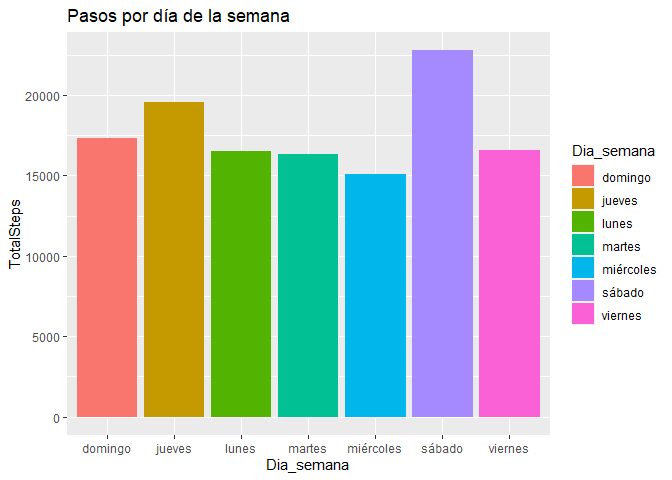
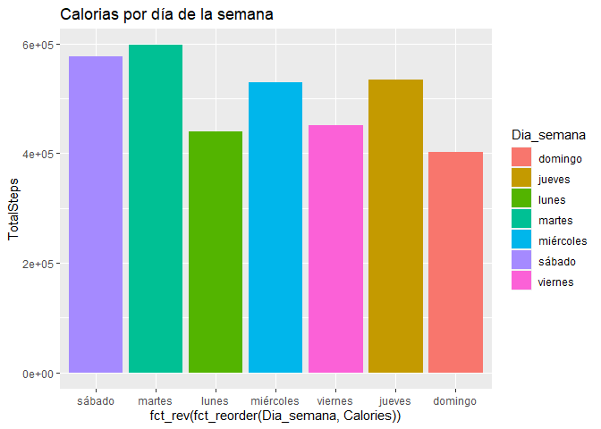
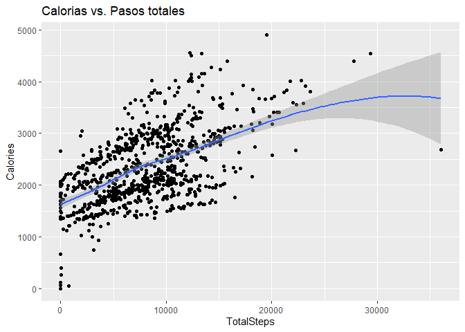
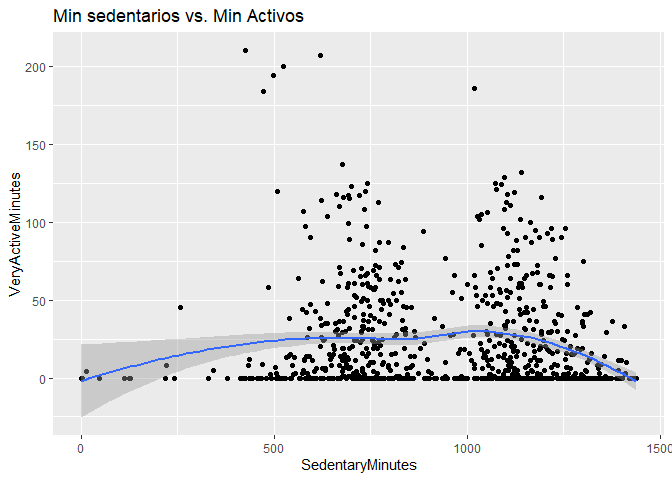
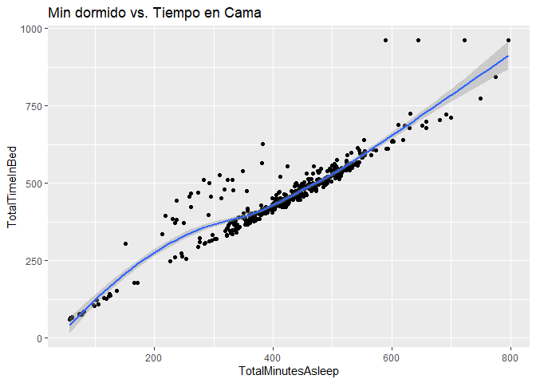
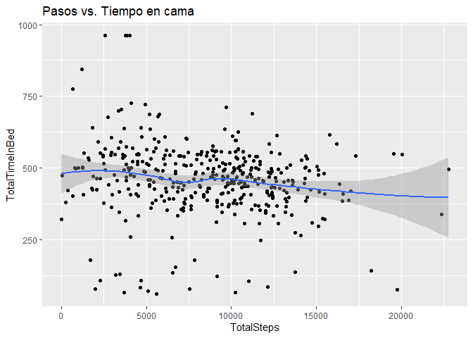
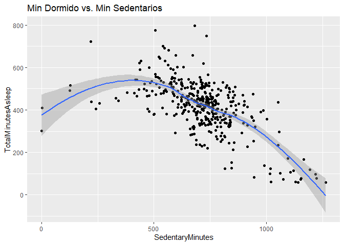
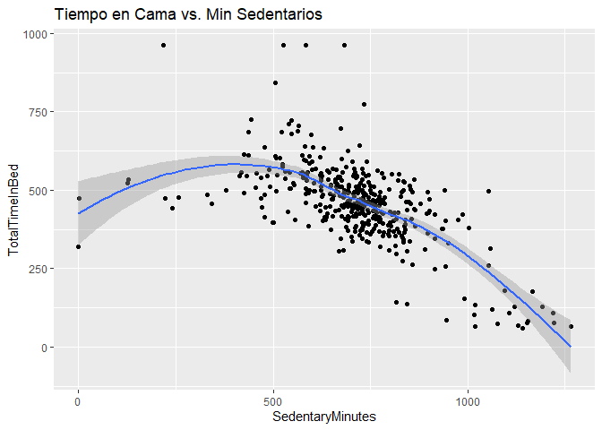

Bellabeat: proyecto final
================

## Contenido

- Contexto
- Segundo

## Contexto

En este proyecto simulamos trabajar para la empresa Bellabeat. Urška
Sršen y Sando Mur fundaron Bellabeat, una empresa de alta tecnología que
fabrica productos inteligentes focalizados en el cuidado de la salud.

¿Qué ha hecho?

- Invirtió en medios tradicionales y en marketing digital
- Invierte en google search y mantiene activas sus redes sociales
- Anuncios de video en YT y avisos publicitarios en Red de Display
  Google en fechas clave.

Orden de trabajo:

Concentrarse en un producto Bellabeat y analizar losdatos de uso de
dispositivos inteligentes para conocer cómo las personas están usando
sus dispositivos inteligentes. Emitir recomendaciones de alto nivel
sobre cómo estas tendencias pueden colaborar en la estrategia de
marketing de Bellabeat.

## Paso cero

A modo de replicar mi trabajo en el futuro desde una perspectiva donde
no recuerde absolutamente nada de lo que estoy haciendo ahora mismo, vi
necesario incluir este paso donde primero tuve que decidir en que
plataforma realizaria la publicación de mi trabajo y resolví que github
es la plataforma más actualizada que ademas de alojar mi proyecto
serviría para aprender a utilizar esta herramienta de control de
versiones y que tambien me ayudaría a crear un portafolio inicial.

Tuve que aprender desde como crear un archivo README en R a conectar Git
desde la misma interfaz de R studio y añadí mi proyecto a github
utilizando las siguientes lineas de comandos:

- git remote add origin
  <https://github.com/AngelGurrola/bellabeat_proyect.git>
- git branch -M main
- git push -u origin main

Utilice el video tutorial de Riffomonas Project para aprender como
conectar RStudio con github disponible en:
<https://www.youtube.com/watch?v=bUoN85QvC10&t=505s>

Una vez teniendo la plataforma lista comence con mi proyecto de analisis
de datos para Bellabeat.

## Preparar

Comenzamos con importar el conjunto de datos: descargamos la carpeta
comprimida desde: <https://www.kaggle.com/datasets/arashnic/fitbit>

Al descomprimir la carpeta de datos se observan 18 tablas con un peso de
322 MB en donde los titulos de cada una nos dan contexto del contenido y
el peso de las mismas nos ayudan a dimensionar la cantidad de datos que
poseen, siendo la tabla heartrate_seconds_merged la más pesada con 87.4
MB y weightLogInfo_merged la mas lígera con 7 KB.

Se añadieron todos los archivos al directorio de trabajo despues de
darles un vistazo rápido desde hoja de cálculo.

La tabla base desde obtendremos las primeras hipotesis será
dailyActivity_merged, la cual provee un resumen diario de los totales de
información recolectada por los dispositivos de Bellabeat.

Entonces se procede a importar las tablas como conjunto de datos de R.

``` r
library(readr)
```

    ## Warning: package 'readr' was built under R version 4.2.2

``` r
library(dplyr)
```

    ## 
    ## Attaching package: 'dplyr'

    ## The following objects are masked from 'package:stats':
    ## 
    ##     filter, lag

    ## The following objects are masked from 'package:base':
    ## 
    ##     intersect, setdiff, setequal, union

``` r
library(ggplot2)
library(tidyverse)
```

    ## Warning: package 'tidyverse' was built under R version 4.2.2

    ## ── Attaching packages
    ## ───────────────────────────────────────
    ## tidyverse 1.3.2 ──

    ## ✔ tibble  3.1.8     ✔ stringr 1.4.1
    ## ✔ tidyr   1.2.0     ✔ forcats 0.5.2
    ## ✔ purrr   0.3.4

    ## Warning: package 'forcats' was built under R version 4.2.2

    ## ── Conflicts ────────────────────────────────────────── tidyverse_conflicts() ──
    ## ✖ dplyr::filter() masks stats::filter()
    ## ✖ dplyr::lag()    masks stats::lag()

``` r
pesos <- read.csv(file="C://Users//an_96//Documents//Bellabeat//Bellabeat//archive//Fitabase Data 4.12.16-5.12.16//weightLogInfo_merged.csv")
pasos <- read.csv(file="C://Users//an_96//Documents//Bellabeat//Bellabeat//archive//Fitabase Data 4.12.16-5.12.16//hourlySteps_merged.csv")
diario <- read.csv(file="C://Users//an_96//Documents//Bellabeat//Bellabeat//archive//Fitabase Data 4.12.16-5.12.16//dailyActivity_merged.csv")
sueño <- read.csv(file="C://Users//an_96//Documents//Bellabeat//Bellabeat//archive//Fitabase Data 4.12.16-5.12.16//sleepDay_merged.csv")
calorias <- read.csv(file="C://Users//an_96//Documents//Bellabeat//Bellabeat//archive//Fitabase Data 4.12.16-5.12.16//dailyCalories_merged.csv")
```

Durante la revisión rápida en hojas de cálculo se observaron notables
diferencias en la cantidad de datos, por lo tanto, se procedió a
confirmar la cantidad de Id que contenian algunas de las tablas.

``` r
n_distinct(pesos$Id)
```

    ## [1] 8

``` r
n_distinct(pasos$Id)
```

    ## [1] 33

``` r
n_distinct(diario$Id)
```

    ## [1] 33

``` r
n_distinct(sueño$Id)
```

    ## [1] 24

``` r
n_distinct(calorias$Id)
```

    ## [1] 33

Se observa como la tabla de pesos incluye unicamente los datos de 8
individuos por lo que deja de ser relevante para el analisis al no ser
una variable que incluyan en todas las tablas.

Así como que la tabla de sueño contiene únicamente los registros de 24
usuarios.

*Desde este punto considero importante mantener un registro más habitual
del peso de los usuarios mediante una notificación de recordatorio a
registrar tu peso.*

Para explorar las tablas se utilizó la libreria de tidyverse

``` r
glimpse(diario)
```

    ## Rows: 940
    ## Columns: 15
    ## $ Id                       <dbl> 1503960366, 1503960366, 1503960366, 150396036…
    ## $ ActivityDate             <chr> "4/12/2016", "4/13/2016", "4/14/2016", "4/15/…
    ## $ TotalSteps               <int> 13162, 10735, 10460, 9762, 12669, 9705, 13019…
    ## $ TotalDistance            <dbl> 8.50, 6.97, 6.74, 6.28, 8.16, 6.48, 8.59, 9.8…
    ## $ TrackerDistance          <dbl> 8.50, 6.97, 6.74, 6.28, 8.16, 6.48, 8.59, 9.8…
    ## $ LoggedActivitiesDistance <dbl> 0, 0, 0, 0, 0, 0, 0, 0, 0, 0, 0, 0, 0, 0, 0, …
    ## $ VeryActiveDistance       <dbl> 1.88, 1.57, 2.44, 2.14, 2.71, 3.19, 3.25, 3.5…
    ## $ ModeratelyActiveDistance <dbl> 0.55, 0.69, 0.40, 1.26, 0.41, 0.78, 0.64, 1.3…
    ## $ LightActiveDistance      <dbl> 6.06, 4.71, 3.91, 2.83, 5.04, 2.51, 4.71, 5.0…
    ## $ SedentaryActiveDistance  <dbl> 0, 0, 0, 0, 0, 0, 0, 0, 0, 0, 0, 0, 0, 0, 0, …
    ## $ VeryActiveMinutes        <int> 25, 21, 30, 29, 36, 38, 42, 50, 28, 19, 66, 4…
    ## $ FairlyActiveMinutes      <int> 13, 19, 11, 34, 10, 20, 16, 31, 12, 8, 27, 21…
    ## $ LightlyActiveMinutes     <int> 328, 217, 181, 209, 221, 164, 233, 264, 205, …
    ## $ SedentaryMinutes         <int> 728, 776, 1218, 726, 773, 539, 1149, 775, 818…
    ## $ Calories                 <int> 1985, 1797, 1776, 1745, 1863, 1728, 1921, 203…

De esta exploracion se observa que la fecha podría convertirse en un
formato que permita manipulación para facilitar el analisis así como el
tipo de datos que se tienen en las distintas columnas.

``` r
# diario
diario$ActivityDate=as.POSIXct(diario$ActivityDate, format="%m/%d/%Y", tz=Sys.timezone())
diario$fecha <- format(diario$ActivityDate, format = "%m/%d/%y")
```

``` r
# En sueño manipulamos para quitar la hora
sueño <- within(data=sueño, SleepDay <-data.frame
                     (do.call('rbind',strsplit(SleepDay," ",fixed=TRUE))))
sueño$SleepDay$X1=as.POSIXct(sueño$SleepDay$X1, format="%m/%d/%Y", tz=Sys.timezone())
sueño$fecha <- format(sueño$SleepDay$X1, format = "%m/%d/%y")
```

Para obtener una mayor descripción de los datos se utilizo la siguiente
función para obtener un resumen de los datos en la tabla de “diario”.

``` r
diario %>%  
  select(TotalSteps, TotalDistance, SedentaryMinutes, Calories) %>%
  summary()
```

    ##    TotalSteps    TotalDistance    SedentaryMinutes    Calories   
    ##  Min.   :    0   Min.   : 0.000   Min.   :   0.0   Min.   :   0  
    ##  1st Qu.: 3790   1st Qu.: 2.620   1st Qu.: 729.8   1st Qu.:1828  
    ##  Median : 7406   Median : 5.245   Median :1057.5   Median :2134  
    ##  Mean   : 7638   Mean   : 5.490   Mean   : 991.2   Mean   :2304  
    ##  3rd Qu.:10727   3rd Qu.: 7.713   3rd Qu.:1229.5   3rd Qu.:2793  
    ##  Max.   :36019   Max.   :28.030   Max.   :1440.0   Max.   :4900

Desde este punto se pueden determinar las respuestas a las preguntas
clave de esta parte del reto:

Los datos tienen un formato largo y se organizan en 18 tablas
almacenadas en archivos csv. Se detectan grandes problemas de sesgo al
tener únicamente 33 usuarios de los cuales no se añaden contexto
demográfico como su ubicación, edad, sexo (se infiere que son mujeres,
pero no se confirma) etc.

Si bien, la pregunta de los interesados está enfocada a la
implementación de una nueva campaña de marketing para la utilización de
los productos de bellabeat sobre los de la competencia, yo consideraría
la posibilidad de ampliar la cantidad de datos para obtener mejores
resultados y un nivel de confianza aceptable.

Para efectos del reto enfocaré los datos a esta pequeña población,
tratándola como un punto de partida para la formulación de hipótesis que
se podrán confirmar con un estudio posterior donde se observen
cantidades de datos significativas.

Se acotará el analisis a las variables de pasos y calorias al ambas
contener datos de los 33 usuarios.

## Procesar

Como se explicó anteriormente, se utilizará el lenguaje de programación
R desde RStudio Desktop para este proyecto, así como el sitio de Github
para su publicación y almacenamiento.

Se procede a buscar duplicados dentro del conjunto de datos.

``` r
sum(duplicated(diario))
```

    ## [1] 0

``` r
sum(duplicated(pasos))
```

    ## [1] 0

``` r
sum(duplicated(calorias))
```

    ## [1] 0

``` r
sum(is.na(diario))
```

    ## [1] 0

``` r
sum(is.na(pasos))
```

    ## [1] 0

``` r
sum(is.na(calorias))
```

    ## [1] 0

Al no encontrarse duplicados en las variables de analisis ni valores NA
se procedió a buscar la cantidad de registros para cada usuario, es
decir, la cantidad de dias que tenía cada usuario en su record diario.

``` r
dias <- diario %>% group_by(Id) %>% 
     summarise(conteo_dias=n(),
               .groups = 'drop')
hist(dias$conteo_dias)
```

<!-- -->

Mediante un histograma básico, se observó una cantidad distinta de
registros para los usuarios.

Se considera reducir el análisis a solo los individuos con más de 25
registros para evitar sesgos por registros incompletos que lleguen a
alterar las cifras completas, sin embargo, se plantea clasificar a los
usuarios como usuarios que no utilizan los productos habitualmente y se
busca aplicar un enfoque distinto creando una columna para el día de la
semana en que se realizó el registro.

Para añadir esta variable se extrae de la columna de fecha el dia de la
semana que se realizó el registro.

``` r
diario <- diario %>% mutate( Dia_semana = weekdays(as.Date(fecha, "%m/%d/%Y", tz=Sys.timezone())))
head(diario)
```

    ##           Id ActivityDate TotalSteps TotalDistance TrackerDistance
    ## 1 1503960366   2016-04-12      13162          8.50            8.50
    ## 2 1503960366   2016-04-13      10735          6.97            6.97
    ## 3 1503960366   2016-04-14      10460          6.74            6.74
    ## 4 1503960366   2016-04-15       9762          6.28            6.28
    ## 5 1503960366   2016-04-16      12669          8.16            8.16
    ## 6 1503960366   2016-04-17       9705          6.48            6.48
    ##   LoggedActivitiesDistance VeryActiveDistance ModeratelyActiveDistance
    ## 1                        0               1.88                     0.55
    ## 2                        0               1.57                     0.69
    ## 3                        0               2.44                     0.40
    ## 4                        0               2.14                     1.26
    ## 5                        0               2.71                     0.41
    ## 6                        0               3.19                     0.78
    ##   LightActiveDistance SedentaryActiveDistance VeryActiveMinutes
    ## 1                6.06                       0                25
    ## 2                4.71                       0                21
    ## 3                3.91                       0                30
    ## 4                2.83                       0                29
    ## 5                5.04                       0                36
    ## 6                2.51                       0                38
    ##   FairlyActiveMinutes LightlyActiveMinutes SedentaryMinutes Calories    fecha
    ## 1                  13                  328              728     1985 04/12/16
    ## 2                  19                  217              776     1797 04/13/16
    ## 3                  11                  181             1218     1776 04/14/16
    ## 4                  34                  209              726     1745 04/15/16
    ## 5                  10                  221              773     1863 04/16/16
    ## 6                  20                  164              539     1728 04/17/16
    ##   Dia_semana
    ## 1     martes
    ## 2  miércoles
    ## 3     jueves
    ## 4    viernes
    ## 5     sábado
    ## 6    domingo

Antes de pasar a analizar el conjunto de datos, combinaremos la tabla de
diario con la de sueño para obtener todos los datos diaros de los
usuarios

``` r
sueño <- sueño[,-c(2)]

juntos <- merge(sueño, diario, by=c('Id', 'fecha'))
head(juntos)
```

    ##           Id    fecha TotalSleepRecords TotalMinutesAsleep TotalTimeInBed
    ## 1 1503960366 04/12/16                 1                327            346
    ## 2 1503960366 04/13/16                 2                384            407
    ## 3 1503960366 04/15/16                 1                412            442
    ## 4 1503960366 04/16/16                 2                340            367
    ## 5 1503960366 04/17/16                 1                700            712
    ## 6 1503960366 04/19/16                 1                304            320
    ##   ActivityDate TotalSteps TotalDistance TrackerDistance
    ## 1   2016-04-12      13162          8.50            8.50
    ## 2   2016-04-13      10735          6.97            6.97
    ## 3   2016-04-15       9762          6.28            6.28
    ## 4   2016-04-16      12669          8.16            8.16
    ## 5   2016-04-17       9705          6.48            6.48
    ## 6   2016-04-19      15506          9.88            9.88
    ##   LoggedActivitiesDistance VeryActiveDistance ModeratelyActiveDistance
    ## 1                        0               1.88                     0.55
    ## 2                        0               1.57                     0.69
    ## 3                        0               2.14                     1.26
    ## 4                        0               2.71                     0.41
    ## 5                        0               3.19                     0.78
    ## 6                        0               3.53                     1.32
    ##   LightActiveDistance SedentaryActiveDistance VeryActiveMinutes
    ## 1                6.06                       0                25
    ## 2                4.71                       0                21
    ## 3                2.83                       0                29
    ## 4                5.04                       0                36
    ## 5                2.51                       0                38
    ## 6                5.03                       0                50
    ##   FairlyActiveMinutes LightlyActiveMinutes SedentaryMinutes Calories Dia_semana
    ## 1                  13                  328              728     1985     martes
    ## 2                  19                  217              776     1797  miércoles
    ## 3                  34                  209              726     1745    viernes
    ## 4                  10                  221              773     1863     sábado
    ## 5                  20                  164              539     1728    domingo
    ## 6                  31                  264              775     2035     martes

La tabla juntos contiene todas las variables de estudio y los datos de
los usuarios reunidos en una única tabla, por lo que será seleccionada
como principal.

Tras haber realizado esta manipulación de los datos, y tomar en cuenta
las consideraciones previamente declaradas. Se procede al siguiente paso
del proyecto.

## Analizar

Primeramente recordaremos los encabezados de nuestra tabla

``` r
colnames(juntos)
```

    ##  [1] "Id"                       "fecha"                   
    ##  [3] "TotalSleepRecords"        "TotalMinutesAsleep"      
    ##  [5] "TotalTimeInBed"           "ActivityDate"            
    ##  [7] "TotalSteps"               "TotalDistance"           
    ##  [9] "TrackerDistance"          "LoggedActivitiesDistance"
    ## [11] "VeryActiveDistance"       "ModeratelyActiveDistance"
    ## [13] "LightActiveDistance"      "SedentaryActiveDistance" 
    ## [15] "VeryActiveMinutes"        "FairlyActiveMinutes"     
    ## [17] "LightlyActiveMinutes"     "SedentaryMinutes"        
    ## [19] "Calories"                 "Dia_semana"

``` r
juntos %>%
  select(TotalMinutesAsleep, TotalTimeInBed, TotalSteps, TotalDistance, SedentaryMinutes, Calories) %>%
  summary()
```

    ##  TotalMinutesAsleep TotalTimeInBed    TotalSteps    TotalDistance   
    ##  Min.   : 58.0      Min.   : 61.0   Min.   :   17   Min.   : 0.010  
    ##  1st Qu.:361.0      1st Qu.:403.0   1st Qu.: 5206   1st Qu.: 3.600  
    ##  Median :433.0      Median :463.0   Median : 8925   Median : 6.290  
    ##  Mean   :419.5      Mean   :458.6   Mean   : 8541   Mean   : 6.039  
    ##  3rd Qu.:490.0      3rd Qu.:526.0   3rd Qu.:11393   3rd Qu.: 8.030  
    ##  Max.   :796.0      Max.   :961.0   Max.   :22770   Max.   :17.540  
    ##  SedentaryMinutes    Calories   
    ##  Min.   :   0.0   Min.   : 257  
    ##  1st Qu.: 631.0   1st Qu.:1850  
    ##  Median : 717.0   Median :2220  
    ##  Mean   : 712.2   Mean   :2398  
    ##  3rd Qu.: 783.0   3rd Qu.:2926  
    ##  Max.   :1265.0   Max.   :4900

### Por dia de la semana

Para comparar los datos desde la perspectiva de día de la semana se
exportó el archivo csv que por cuestiones de tiempo facilitó el análisis
y la creación de gráficos.

Usando la función:

write.csv(diario, file = “diario.csv”)

De igual manera se intentaron realizar las gráficas desde R:

``` r
##diario$Dia_semana = factor(diario$Dia_semana, levels = c("lunes", "martes", "miércoles", "jueves", "sábado", "domingo"))
```

``` r
df %>%
ggplot(data = juntos, mapping = aes(x = Dia_semana, y = TotalSteps, fill = Dia_semana))+ geom_bar(stat = "identity", position = "dodge") + labs(title = "Pasos por dia de la semana") 
```

<!-- -->

``` r
library(forcats)
df %>%
ggplot(data = juntos, mapping = aes(x = fct_rev(fct_reorder(Dia_semana, Calories)), y = TotalSteps, fill = Dia_semana))+ geom_bar(stat = "identity") + labs(title = "Pasos por dia de la semana") 
```

<!-- -->

Para corroborar el uso de los dispositivos de Bellabeat por día de la
semana se graficaron los registros en excel como se muestra en las
siguientes imagenes:

 

### Hipotesis de pesos

Aún cuando se descartó la importancia de la tabla de pesos resumiremos
los datos para conocer las características de los usuarios que sí
registraton datos.

``` r
usuariospesos <- pesos %>% 
  select(Id, BMI, IsManualReport) %>% 
  group_by(Id, IsManualReport) %>%  
  summarise(IMCpromedio = mean(BMI), n = n())
```

    ## `summarise()` has grouped output by 'Id'. You can override using the `.groups`
    ## argument.

``` r
arrange(usuariospesos, IMCpromedio)
```

    ## # A tibble: 8 × 4
    ## # Groups:   Id [8]
    ##           Id IsManualReport IMCpromedio     n
    ##        <dbl> <chr>                <dbl> <int>
    ## 1 2873212765 True                  21.6     2
    ## 2 1503960366 True                  22.6     2
    ## 3 6962181067 True                  24.0    30
    ## 4 8877689391 False                 25.5    24
    ## 5 4558609924 True                  27.2     5
    ## 6 4319703577 True                  27.4     2
    ## 7 5577150313 False                 28       1
    ## 8 1927972279 False                 47.5     1

De esta tabla esperaba obtener la cantidad de reportes efectuados
manualmente considerando el IMC de la persona. Buscando una relación
entre las variables, sin embargo, por la cantidad de datos se debe
resolver primero que se obtengan los datos de más participantes.
Considero que uno de los mejores indicadores de la salud de una persona
es el Indice de Masa Corporal (BMI en inglés) y por tanto se me ocurre
ofrecer paquetes de productos donde se utilicen productos que monitoreen
el IMC para que la aplicación de Bellabeat ofrezca notificaciones cuando
este se vea fuera de sus parámetros normales, pasando a un monitoreo
activo de tu IMC.

### Relaciones entre variables

#### Diario

En este apartado se revisaron las diferentes correlaciones que pueden
existir dentro de la tabla de diario.

Se comenzó por una hipotesis obvia donde a mayor cantidad de pasos,
mayor cantidad de calorías visualizando como se muestra a continuación:

``` r
ggplot(data=diario, aes(x=TotalSteps, y=Calories)) + 
  geom_point() + geom_smooth() + labs(title="Calorias vs. Pasos totales")
```

    ## `geom_smooth()` using method = 'loess' and formula 'y ~ x'

<!-- -->

*Se pueden crear indicadores para los usuarios donde se indique la
cantidad de calorias que han quemado con base a sus pasos y si quieren
fijar una meta de calorías convertirla a una meta de pasos o distancia
por recorrer.*

``` r
ggplot(data=diario, aes(x=SedentaryMinutes, y=VeryActiveMinutes)) + 
  geom_point() + geom_smooth() + labs(title="Min sedentarios vs. Min Activos")
```

    ## `geom_smooth()` using method = 'loess' and formula 'y ~ x'

<!-- -->

Se esperaba observar una relación negativa entre estas variables que,
aunque existe una tendencia negativa, no se confirma con certeza, esto
podría deberse a la poca cantidad de datos , sin embargo, es interesante
ver puntos con altos niveles de ambas variables, tal vez, refiriendose a
personas que durante su jornada laboral entran en la clasificación de
sedentario pero que, al salir, se vuelven muy activos.

*A lo largo del dia, en medida que se aumenten los minutos de la
categoría sedentarios la aplicación puede notificar al usuario que de un
pequeño estiron, ejercicios de estiramiento o simplemente dar un
respiro.*

#### Sueño

La tabla de sueño también se analizó por separado para la relación entre
las únicas dos variables contenidas en la tabla:

``` r
ggplot(data=sueño, aes(x=TotalMinutesAsleep, y=TotalTimeInBed)) + 
  geom_point() + geom_smooth() + labs(title="Min dormido vs. Tiempo en Cama")
```

    ## `geom_smooth()` using method = 'loess' and formula 'y ~ x'

<!-- -->

Se observa lo obvio, sin embargo, esto nos sirve para **confirmar la
confiabilidad de los datos.**

#### Juntos

Se continuó a analizar la tabla combinada de juntos:

Primeramente visualizando la Cantidad de Casos contra el Tiempo en Cama

``` r
ggplot(data=juntos, aes(x=TotalSteps, y=TotalTimeInBed)) + 
  geom_point() + geom_smooth() + labs(title="Pasos vs. Tiempo en cama")
```

    ## `geom_smooth()` using method = 'loess' and formula 'y ~ x'

<!-- -->

``` r
ggplot(data=juntos, aes(x=SedentaryMinutes, y=TotalMinutesAsleep)) + 
  geom_point() + geom_smooth() + labs(title="Min Dormido vs. Min Sedentarios")
```

    ## `geom_smooth()` using method = 'loess' and formula 'y ~ x'

<!-- -->

De esta gráfica se obtiene una correlación negativa entre la cantidad de
tiempo que una persona duerme contra la cantidad de minutos sedentarios
que el usuario tiene durante el día.

``` r
ggplot(data=juntos, aes(x=SedentaryMinutes, y=TotalTimeInBed)) + 
  geom_point() + geom_smooth() + labs(title="Tiempo en Cama vs. Min Sedentarios")
```

    ## `geom_smooth()` using method = 'loess' and formula 'y ~ x'

<!-- -->

Se confirman la relación utilizando la otra variable de la tabla de
sueño, Tiempo en cama, donde se obtiene básicamente la misma gráfica.

Una diferencia importante es la como la información en el eje y, que
reflejan las variables de sueño presentan valores distintos, indicando
que, mayor tiempo en cama no es necesariamente tiempo dormido.

*La aplicación puede recomendar realizar ejercicios de meditación para
conciliar el sueño más rapidamente cuando llegue la hora de acostarse y
así pasar más tiempo efectivo de sueño y no solo acostado.*

## Resultados

● ¿Cómo deberías organizar tus datos para realizar un análisis?

Los datos se organizaron de manera que pudieron ser manipulables y
combinados. Se observaron las gráficas de dispersión para corroborar la
confiabilidad en los datos.

● ¿Tus datos tienen el formato correcto?

La tabla de juntos parece presentar problemas de combinación, por lo
tanto hay que re intentar

● ¿Qué sorpresas descubriste en los datos?

Los formatos de fecha y hora pueden ser un dolor de cabeza.

● ¿Qué tendencias o relaciones encontraste en los datos?

Hipotesis obvias de como funciona el cuerpo,

● ¿Cómo te ayudarán estos conocimientos para responder a tus preguntas
empresariales?

Confirmando lo obvio, pero respaldado por los datos, no solo por mi
conocimiento empirico.

## Compartir

Se realizaron observaciones a lo largo del documento con el formato de
*italicas*
